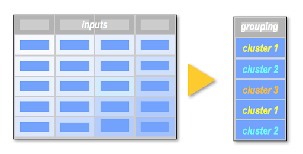

```{r setup, include=FALSE}

## knitr options
# knitr::opts_chunk$set(comment = NA)
# knitr::opts_chunk$set(warning = FALSE)
# knitr::opts_chunk$set(message = FALSE)
# knitr::opts_chunk$set(echo = FALSE)

## general options
options(stringsAsFactors = FALSE)
options(digits=3)

## load the packages
library(tidyverse)
library(ggplot2)
library(arules)
library(arulesViz)
library(DT)
library(wakefield)


```

background-image: url("../../assets/BU_Questrom.png")
background-position: 5% 99%
background-size: 160px

# Outline for Today


.pull-left[
- Unsupervised Machine Learning Overview
- The Usage of Distance Metrics
- Cluster Analysis via Hierarchical Clustering (Hclust)
]


<br>


```{r echo=FALSE, out.width='45%'}
knitr::include_graphics("../../assets/dendro.png")
```


---
class: center, bottom
background-image: url("../../assets/zoom-logo.png")

> All of our classes will be recorded and posted to Resources > Recorded Meetings


---
class:  segue, center
background-image: url("../../assets/BU_Questrom.png")
background-position: 5% 99%
background-size: 160px

.font200[Unsupervised Machine Learning]


---
background-image: url("../../assets/BU_Questrom.png"), url("../../assets/uml-overview.png")
background-position: 5% 99%, 35% 70%
background-size: 160px, 1000px

# ML Landscape - Big Picture


---
background-image: url("../../assets/BU_Questrom.png"), url("../../assets/needle.jpg")
background-position: 5% 99%, 15% 50%
background-size: 160px, 400px

# Pattern Discovery

.pull-right[
<br>
<br>
<br>
<br>
<br>
_“…the discovery of interesting, unexpected, or valuable structures in large data sets.”_

_David Hand_
]


---
background-image: url("../../assets/BU_Questrom.png")
background-position: 5% 99%
background-size: 160px

# Unsupervised Learning - Applications

Clustering:

- Marketing Contexts for Customer Segmentation and Persona Development
- Market Segmentation for Retail Site Planning or Urban Development
- Information Retrieval on the web
- Biology (similar genes or organisms)
- Sports Analytics (Player similarities)

Dimension Reduction:

- Smaller search space with little loss in _information_
- Latent construct identification

.content-box-red[UML can be used downstream in SML tasks and even help with data annotation tasks!]


---
background-image: url("../../assets/BU_Questrom.png")
background-position: 5% 99%
background-size: 160px

# Cluster Analysis - Bigger Picture

.pull-left[
- Group of cases (observations/rows) based on similarities in input values
- Unlike supervised learning, .red[no label exists], so cluster labels are generated
  - Sometimes we elect to remove variables that could act as targets in SML tasks. 
  - We do this avoid remove impact on cluster determination and to profile later.

When we have clusters, we can:
- Use the input as a categorical value for SML
- Profile the segments to tell a story and take action 
]

.pull-right[
<br>
<br>
<br>

]


---
background-image: url("../../assets/BU_Questrom.png")
background-position: 5% 99%
background-size: 160px

# The Two Methods We Will Explore

.pull-left[
### Hierarchical Clustering (Hclust)

- Also referred to as agglomerative clustering
- A "bottom-up" approach
- Intuitive approach and let's us as analysts determine our cluster solution
]

.pull-right[
### K-Means Clustering

- We set the number of clusters up-front, this is .red[_K_]
- The algorithm uses _K_ to identify clusters from our search space 
- This is usually done by minimizing the distance from each point to it's cluster center
- This is the topic for next week
]

<hr>

- In either case, we are using a concept of distance to join, or cluster, our records


---
class:segue-red, center, middle
background-image: url("../../assets/BU_Questrom.png")
background-position: 5% 99%
background-size: 160px

# Distance


---
background-image: url("../../assets/BU_Questrom.png")
background-position: 5% 99%
background-size: 160px

# Distance Intro

.font130[Let's start with a simple, 1-dimensional example.  How would you group the observations to _minimize_ distance?]

```{r echo=F, fig.align='center', fig.height=3, fig.width=15}
set.seed(9999)
dat = data.frame(x= sample(1:21, 9), y=0)
dat =  arrange(dat, x)
p = ggplot(dat, aes(x, y, label=x)) + 
  geom_hline(yintercept = 0, colour="#DCDCDC") +
  geom_point(size=13, alpha=.95) +
  geom_text(aes(label=x), vjust=5, size=10) +
  scale_x_continuous(breaks = NULL) + 
  scale_y_continuous(breaks = NULL) + 
  # xlim(-3, 18) +
  theme_minimal() +
  theme(panel.grid.major = element_blank(),
        panel.grid.minor = element_blank(),
        axis.title.x=element_blank(),
        axis.title.y=element_blank())
p 
```

---
background-image: url("../../assets/BU_Questrom.png")
background-position: 5% 99%
background-size: 160px

# Distance Intro

.font130[Let's start with a simple, 1-dimensional example.  How would you group the observations to _minimize_ distance?]

```{r echo=F, fig.align='center', fig.height=3, fig.width=15}
set.seed(9999)
COLORS = c(rep("red", 2), "grey", rep("blue", 4), rep("purple", 2))
p = ggplot(dat, aes(x, y, label=x)) + 
  geom_hline(yintercept = 0, colour="#DCDCDC") +
  geom_point(size=13, alpha=.95, color = COLORS) +
  geom_text(aes(label=x), vjust=5, size=10) +
  scale_x_continuous(breaks = NULL) + 
  scale_y_continuous(breaks = NULL) + 
  # xlim(-3, 18) +
  theme_minimal() +
  theme(panel.grid.major = element_blank(),
        panel.grid.minor = element_blank(),
        axis.title.x=element_blank(),
        axis.title.y=element_blank())
p 
```

<br>

> What do you think we should do with the point in grey?


---
class: center, middle
background-image: url("../../assets/BU_Questrom.png")
background-position: 5% 99%
background-size: 160px

# .red[Distance Measures]


---
background-image: url("../../assets/BU_Questrom.png"), url("https://i1.wp.com/dataaspirant.com/wp-content/uploads/2015/04/euclidean.png?w=600&ssl=1")
background-position: 5% 99%, 94% 55%
background-size: 160px, 600px

## Euclidean Distance

.pull-left[
- Straight-line Distance
- One of the most used approaches across a number of techniques
- Works for numerical inputs only
]


---
background-image: url("../../assets/BU_Questrom.png"), url("https://i2.wp.com/dataaspirant.com/wp-content/uploads/2015/04/manhattan.png?w=600&ssl=1")
background-position: 5% 99%, 94% 55%
background-size: 160px, 600px

## Manhattan Distance

.pull-left[
- Total line distance
- Just like navigating or walking a grid-based city (e.g. Manhattan)
- Works for numerical inputs only
- Could be better if the domain of the problem maps to grid-like issues
  - Optimizing route planning
- Also, could be a better choice if you have a __large__ number of columns or want to place less emphasis on outliers
]


---
background-image: url("../../assets/BU_Questrom.png"), url("https://i2.wp.com/dataaspirant.com/wp-content/uploads/2015/04/cosine.png?w=697&ssl=1")
background-position: 5% 99%, 94% 55%
background-size: 160px, 600px

## Cosine

.pull-left[
- The magnitude is not measured, but the cosine of the angle between the two vectors
- Used fairly often in recommender systems when we are calculating distance based on product ratings or when comparing word/document embeddings
  - The numeric columns are ratings of a movie or a product (e.g. Netflix or Amazon)
- For pairwise comparisons, all items/columns (embedding) are considered

]


---
background-image: url("../../assets/BU_Questrom.png")
background-position: 5% 99%
background-size: 160px

## Jaccard

.pull-left[
- More appropriate for categorical data, not numeric observations on a number line
- If we have categorical data, we can make it _numeric_ by dummy-encoding, also called one-hot encoding, of the data
- Think of the items as off or 0/1, where 1 is True, or "On" or "Present"
- For the pairwise comparison of records, the total items across both are considered, and use the overlap to determine how similar they are as a ratio of the total items in common

Unlike Cosine similarity, the union is the denominator
]

.pull-right[


<br>


]


---
background-image: url("../../assets/BU_Questrom.png")
background-position: 5% 99%
background-size: 160px

## Distance Summary

- There are many other distance metrics available, but these are the 4 that I see appear in real-world solutions (or are at least, considered in an analysis)

- As mentioned earlier, the distance measure is applied pairwise, that is, all records are compared against each other

> Question:  What is the distance when a record is compared with itself?


---
class: center, middle
background-image: url("../../assets/BU_Questrom.png")
background-position: 5% 99%, 94% 55%
background-size: 160px, 600px

# Hierarchical Clustering


---
background-image: url("../../assets/BU_Questrom.png"), url("../../assets/hclust-explain.png") 
background-position: 5% 99%, 50% 55%
background-size: 160px, 1000px

# A Bottom-up Approach


---
background-image: url("../../assets/BU_Questrom.png"), url("https://cdn2.iconfinder.com/data/icons/arrows-1-2/380/Arrow_Top2-512.png")
background-position: 5% 99%, 98% 50%
background-size: 160px, 150px

# Another Example


---
background-image: url("../../assets/BU_Questrom.png")
background-position: 5% 99%
background-size: 160px

# Remember our 1-D Example?


```{r echo=F, fig.align='center', fig.height=2, fig.width=15}
set.seed(9999)
dat = data.frame(x= sample(1:21, 9), y=0)
dat =  arrange(dat, x)
p = ggplot(dat, aes(x, y, label=x)) + 
  geom_hline(yintercept = 0, colour="#DCDCDC") +
  geom_point(size=13, alpha=.95) +
  geom_text(aes(label=x), vjust=5, size=6) +
  scale_x_continuous(breaks = NULL) + 
  scale_y_continuous(breaks = NULL) + 
  # xlim(-3, 18) +
  theme_minimal() +
  theme(panel.grid.major = element_blank(),
        panel.grid.minor = element_blank(),
        axis.title.x=element_blank(),
        axis.title.y=element_blank())
p 
```

--


```{r echo=F, fig.align='center', fig.height=2, fig.width=15}
set.seed(9999)
COLORS = c(rep("red", 2), "grey", rep("blue", 4), rep("purple", 2))
p = ggplot(dat, aes(x, y, label=x)) + 
  geom_hline(yintercept = 0, colour="#DCDCDC") +
  geom_point(size=13, alpha=.95, color = COLORS) +
  geom_text(aes(label=x), vjust=5, size=6) +
  scale_x_continuous(breaks = NULL) + 
  scale_y_continuous(breaks = NULL) + 
  # xlim(-3, 18) +
  theme_minimal() +
  theme(panel.grid.major = element_blank(),
        panel.grid.minor = element_blank(),
        axis.title.x=element_blank(),
        axis.title.y=element_blank())
p 
```


--

<br>
<br>

> How do we group/cluster point 6?


---
class:segue-red, center, middle
background-image: url("../../assets/BU_Questrom.png")
background-position: 5% 99%, 94% 55%
background-size: 160px, 600px

# Linkage Methods


---
background-image: url("../../assets/BU_Questrom.png"), url("../../assets/linkage-type.png")
background-position: 5% 99%, 85% 65%
background-size: 160px, 450px

# Linkage Methods

.pull-left[

#### Single Linkage
- The shortest connection between items/clusters

#### Complete Linkage
- The farthest connection between items/clusters

#### Average Linkage
- The average connection distance between all items/clusters in consideration

]


???

http://girke.bioinformatics.ucr.edu/GEN242/pages/mydoc/Rclustering.html


---
background-image: url("../../assets/BU_Questrom.png")
background-position: 5% 99%
background-size: 160px

# Different Linkage Methods 

```{r echo=F, fig.align='center', fig.height=2, fig.width=15}
set.seed(9999)
COLORS = c(rep("red", 2), "grey", rep("blue", 4), rep("purple", 2))
p = ggplot(dat, aes(x, y, label=x)) + 
  geom_hline(yintercept = 0, colour="#DCDCDC") +
  geom_point(size=13, alpha=.95, color = COLORS) +
  geom_text(aes(label=x), vjust=5, size=6) +
  scale_x_continuous(breaks = NULL) + 
  scale_y_continuous(breaks = NULL) + 
  # xlim(-3, 18) +
  theme_minimal() +
  theme(panel.grid.major = element_blank(),
        panel.grid.minor = element_blank(),
        axis.title.x=element_blank(),
        axis.title.y=element_blank())
p 
```


<hr>

Your turn = Classify the points

1.  Single Linkage?

--

1.  Complete Linkage?

--

1.  Average Linkage?


???
2/blue, 4/red, 3.5 < 3.75 red


---
class: segue-red

.font200[Let's write some code]

